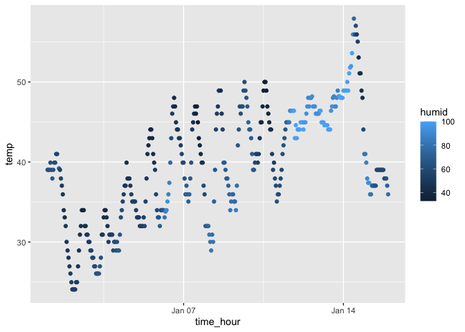

Homework1
================
Zihan Xiong
2024-09-20

# Problem 1

*Package penguins has been installed*

``` r
library(moderndive)
library(tidyverse)
```

    ## ── Attaching core tidyverse packages ──────────────────────── tidyverse 2.0.0 ──
    ## ✔ dplyr     1.1.4     ✔ readr     2.1.5
    ## ✔ forcats   1.0.0     ✔ stringr   1.5.1
    ## ✔ ggplot2   3.5.2     ✔ tibble    3.3.0
    ## ✔ lubridate 1.9.4     ✔ tidyr     1.3.1
    ## ✔ purrr     1.1.0     
    ## ── Conflicts ────────────────────────────────────────── tidyverse_conflicts() ──
    ## ✖ dplyr::filter() masks stats::filter()
    ## ✖ dplyr::lag()    masks stats::lag()
    ## ℹ Use the conflicted package (<http://conflicted.r-lib.org/>) to force all conflicts to become errors

***Load** the data*

``` r
data("early_january_weather")
```

*Description of the dataset using inline R code:* The dataset is a
**data frame** with 358 rows and 15 variables.

Key variables include:

1.  **origin**: Weather station ID (useful for merging with other
    datasets like `nycflights13::flights`).
2.  **year, month, day, hour**: Time of recording.
3.  **temp, dewp**: Temperature and dewpoint in °F.
4.  **humid**: Relative humidity (%).
5.  **wind_dir, wind_speed, wind_gust**: Wind direction (°), speed, and
    gust speed (mph).
6.  **precip**: Precipitation (in inches).
7.  **pressure**: Sea level pressure in millibars.
8.  **visib**: Visibility in miles.
9.  **time_hour**: Date-time of recording (POSIXct).

The ***mean temperature*** during this period is 39.6 °F.

Make Scatterplot of ***temperature vs date-time of recording***

``` r
library(ggplot2)
scatterplot <- ggplot(early_january_weather,aes(x=time_hour,y=temp,color=humid))+geom_point()
scatterplot
```

<!-- -->

``` r
ggsave("temp_vs_time_plot.png", plot=scatterplot, width=6, height=4)
```

***Patterns** of the scatterplot:* The scatterplot shows that
temperature generally **increases** over the course of early January,
with clear daily fluctuations. We can also observe that there was an
**inversive** relationship between humidity and temperature. Higher
humidity are associated with lower temperature.

# Problem 2

First, create a **data frame** with four types of variables:

``` r
library(tidyverse)

set.seed(1234)

prob2_df = tibble(
  norm_sample = rnorm(10),                      # numeric
  vec_logical = norm_sample > 0,                  # logical, True=1, False=0
  vec_char = c("a","b","c","d","e","f","g","h","i","j"),  # character
  vec_factor= factor(c("a","b","c","a","b","c","a","b","c","a"))  # factor
)

prob2_df
```

    ## # A tibble: 10 × 4
    ##    norm_sample vec_logical vec_char vec_factor
    ##          <dbl> <lgl>       <chr>    <fct>     
    ##  1      -1.21  FALSE       a        a         
    ##  2       0.277 TRUE        b        b         
    ##  3       1.08  TRUE        c        c         
    ##  4      -2.35  FALSE       d        a         
    ##  5       0.429 TRUE        e        b         
    ##  6       0.506 TRUE        f        c         
    ##  7      -0.575 FALSE       g        a         
    ##  8      -0.547 FALSE       h        b         
    ##  9      -0.564 FALSE       i        c         
    ## 10      -0.890 FALSE       j        a

Now we try to take the **mean** of each variables in the dataframe.

- The mean of the numeric variable **norm_sample** is -0.3831574 .
- The mean of the logical variable **vec_logical** is 0.4 , indicating
  that 40% of this sample values are greater than 0.
- The mean of the character variable **vec_char** is NA .
- The mean of the factor variable **vec_factor** is NA .

Noticed that we are not able to take the mean of **character vectors**
and **factor vectors** because they are not directly **numeric** .

Now we apply **as.numeric()** to the **non-numeric variables** :

``` r
as.numeric(prob2_df$vec_logical)
as.numeric(prob2_df$vec_char)
as.numeric(prob2_df$vec_factor)
```

After applying `as.numeric()` to the different variable types gives
different results:

For the **logical vector**, `TRUE` values are converted to 1 and `FALSE`
values to 0.  
This explains why we can directly take the mean of a logical vector: the
mean is simply the proportion of `TRUE` values.

For the **character vector**, conversion produces `NA` values and a
warning `NAs introduced by coercion` . Since characters cannot be
meaningfully coerced into numbers, which explains why calculating mean
of the character vectos produced an error.

For the **factor vector**, conversion produces numbers `1,2,3` , which
gives the underlying integer codes for the factor levels (e.g.,
`"a" = 1`, `"b" = 2`, `"c" = 3`). Although these are numeric results, it
is not meaningful. The assigned numbers are arbitrary labels, not real
values. So we still don’t see the mean of the factor vectors.
